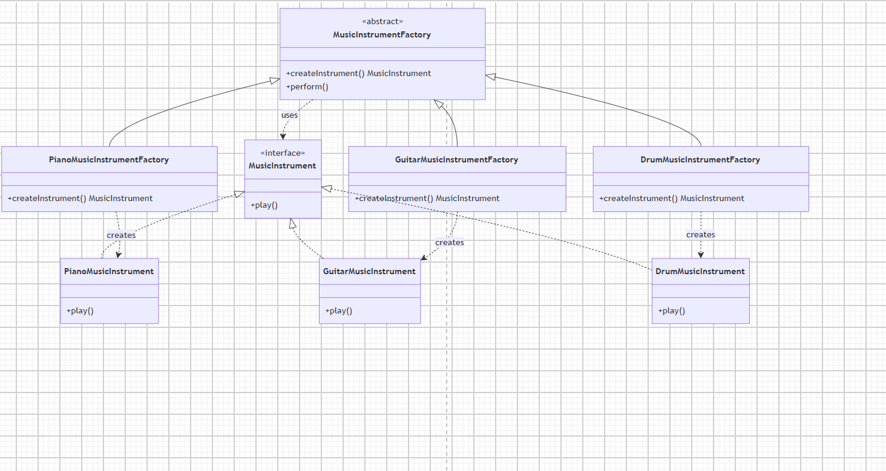
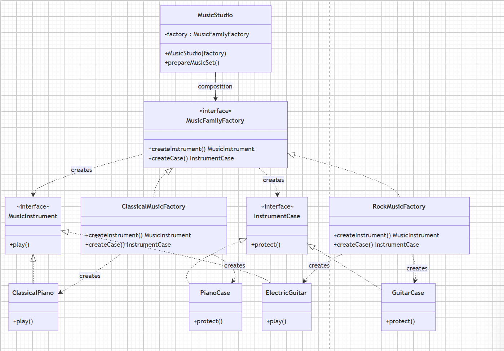

# Assignment 2 — Creational Patterns

## 1. Introduction

This assignment focuses on two creational design patterns:
Factory Method and Abstract Factory.

The main goal is to understand how these patterns separate object
creation from client code and reduce direct dependencies on concrete
classes.

For this project, I chose the Music Instruments domain. Factory Method
is used to create individual music instruments, while Abstract Factory
is used to create compatible families of related music products.


## 2. Chosen Domain

The chosen domain for this assignment is Music Instruments.

For Part A, the application creates individual instruments such as
Piano, Guitar, and Drum.

For Part B, the application creates two related product families:
Classical and Rock.

The Classical family contains a Classical Piano and a Piano Case.
The Rock family contains an Electric Guitar and a Guitar Case.


# 3. Factory Method

## 3.1 Structure

The Factory Method pattern is implemented in the factorymethod
package.

MusicInstrument is the Product interface. It defines the play()
method that is implemented by all concrete instruments.

The Concrete Products are:

- PianoMusicInstrument
- GuitarMusicInstrument
- DrumMusicInstrument

MusicInstrumentFactory is the abstract Creator. It declares the
createInstrument() factory method and contains the perform() business
method.

The Concrete Creators are:

- PianoMusicInstrumentFactory
- GuitarMusicInstrumentFactory
- DrumMusicInstrumentFactory

Each Concrete Creator overrides createInstrument() and creates its
corresponding instrument.

## 3.2 UML Diagram



The diagram shows the relationship between the Product, Concrete
Products, Creator, and Concrete Creators.

## 3.3 How It Works

The client does not create concrete instruments directly.

Instead, it works with MusicInstrumentFactory. Each concrete factory
decides which instrument should be created.

For example, PianoMusicInstrumentFactory creates a
PianoMusicInstrument, while GuitarMusicInstrumentFactory creates a
GuitarMusicInstrument`.

The perform() method uses the created object through the
MusicInstrument interface.

## 3.4 Advantages

Factory Method separates object creation from the client code.

It is easier to add a new type of instrument because a new Concrete
Product and Concrete Creator can be added without changing the existing
product classes.

The client also does not need to know the details of how a concrete
instrument is created.

## 3.5 Disadvantages

The main disadvantage is that the number of classes can increase.

For every new instrument type, a new product class and usually a new
factory class are needed.

For a very small application, this can make the design more complicated
than necessary.


# 4. Abstract Factory

## 4.1 Structure

The Abstract Factory pattern is implemented in the
abstractfactory package.

There are two Abstract Products:

- MusicInstrument
- InstrumentCase

MusicInstrument defines the play() method, while InstrumentCase
defines the protect() method.

The Concrete Products are:

- ClassicalPiano
- PianoCase
- ElectricGuitar
- GuitarCase

MusicFamilyFactory is the Abstract Factory. It defines two creation
methods:

- createInstrument()
- createCase()

The Concrete Factories are:

- ClassicalMusicFactory
- RockMusicFactory

ClassicalMusicFactory creates the Classical family, while
RockMusicFactory creates the Rock family.

## 4.2 UML Diagram



The diagram shows how each Concrete Factory creates a complete family
of related products.

## 4.3 Product Families

The Classical family contains:

- ClassicalPiano
- PianoCase

The Rock family contains:

- ElectricGuitar
- GuitarCase

The products from each family are created by the same Concrete Factory,
which keeps the family consistent.

## 4.4 Client and Composition

MusicStudio is the client of the Abstract Factory.

It receives a MusicFamilyFactory through its constructor.

The client depends on the MusicFamilyFactory interface instead of
depending directly on concrete factories or concrete products.

This demonstrates composition because MusicStudio contains a reference
to a MusicFamilyFactory object.

## 4.5 How It Works

The family is selected in one place in the application.

For example:

```java
MusicFamilyFactory factory =
        new ClassicalMusicFactory();

MusicStudio studio =
        new MusicStudio(factory);

studio.prepareMusicSet();
```
## 4.6 Advantages

The main advantage of Abstract Factory is that it creates a complete
family of related products.

It allows the application to switch between product families without
changing the client code.

It also helps prevent incompatible products from being mixed because
the products are created by the same Concrete Factory.

## 4.7 Disadvantages

The main disadvantage is that adding a new type of product to the
family can require changes to the Abstract Factory and all Concrete
Factories.

For example, if a new product such as MusicStand is added to the
family, every factory may need a new creation method.

Therefore, Abstract Factory can become more complicated when the product
family changes frequently.

## 5. Factory Method vs Abstract Factory

Factory Method creates one type of product.

In this project, Factory Method creates individual
MusicInstrument objects such as piano, guitar, and drum.

Abstract Factory creates a family of related products.

In this project, Abstract Factory creates both a MusicInstrument and
an InstrumentCase.

Factory Method mainly demonstrates inheritance because Concrete
Creators extend the abstract Creator.

Abstract Factory demonstrates composition because MusicStudio
receives a factory object through its constructor.

Therefore, Factory Method focuses on creating one product, while
Abstract Factory focuses on creating a compatible family of products.

## 6. SOLID Principles
Open/Closed Principle

The project demonstrates the Open/Closed Principle because new
instrument types can be added without modifying the existing product
classes.

For example, a new ViolinMusicInstrument and
ViolinMusicInstrumentFactory could be added.

Single Responsibility Principle

The classes have separate responsibilities.

The instrument classes are responsible for instrument behavior.

The factory classes are responsible for object creation.

The client is responsible for using the created products.

## 7. Project Structure

assignment2-design-patterns/
│
├── src/
│   └── main/
│       └── java/
│           │
│           ├── factorymethod/
│           │   ├── MusicInstrument.java
│           │   ├── PianoMusicInstrument.java
│           │   ├── GuitarMusicInstrument.java
│           │   ├── DrumMusicInstrument.java
│           │   │
│           │   ├── MusicInstrumentFactory.java
│           │   ├── PianoMusicInstrumentFactory.java
│           │   ├── GuitarMusicInstrumentFactory.java
│           │   ├── DrumMusicInstrumentFactory.java
│           │   │
│           │   └── Main.java
│           │
│           └── abstractfactory/
│               ├── MusicInstrument.java
│               ├── InstrumentCase.java
│               │
│               ├── ClassicalPiano.java
│               ├── PianoCase.java
│               ├── ElectricGuitar.java
│               ├── GuitarCase.java
│               │
│               ├── MusicFamilyFactory.java
│               ├── ClassicalMusicFactory.java
│               ├── RockMusicFactory.java
│               │
│               ├── MusicStudio.java
│               └── Main.java
│
├── diagrams/
│   ├── FactoryMethod.png
│   └── AbstractFactory.png
│
├── README.md
└── pom.xml
## 8. How to Run

Run the Main class in the factorymethod package to test the
Factory Method implementation.

Expected output:

Playing piano music.
Playing guitar music.
Playing drum music.

Run the Main class in the abstractfactory package to test the
Abstract Factory implementation.

For the Classical family, the output is similar to:

Playing classical piano music.
Protecting the piano with a classical piano case.

The factory can then be changed to RockMusicFactory to switch to the
Rock family.

## 9. Conclusion

This assignment demonstrates the Factory Method and Abstract Factory
patterns using the Music Instruments domain.

Factory Method separates the creation of individual instruments from
the client code.

Abstract Factory allows the application to create complete and
compatible families of related products.

The implementation also demonstrates the Open/Closed Principle and the
Single Responsibility Principle.

The patterns provide useful flexibility, but they can be unnecessary
for very small applications because they introduce additional classes
and complexity.
